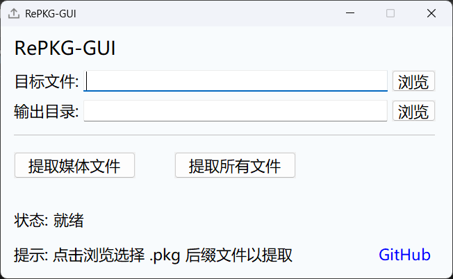

# RePKG-GUI
> RePKG 图形界面工具 - 基于 AutoHotkey v2.0

## 界面预览

## 功能特性
- 提取 PKG 文件中的媒体资源（PNG/MP4/GIF）
- 提取 PKG 文件中的所有文件
- 自动设置输出目录
- 清理临时文件
- 提取完成自动打开目录
- 错误提示完善

## 快速开始

### 方法 1：直接使用
1. 下载 [Release](https://github.com/Zerin-emm/RePKG-GUI/releases) 中的 `RePKG-GUI_x64.exe`
2. 双击运行

### 方法 2：从源码运行
1. 安装 [AutoHotkey v2](https://www.autohotkey.com/)
2. 克隆仓库：`git clone https://github.com/Zerin-emm/RePKG-GUI.git`
3. 确保 `RePKG.exe` 文件与 `AHK.ahk` 在同一目录
4. 双击运行 `AHK.ahk`

## 注意事项

- 需要 RePKG.exe 文件（已打包到编译后的 EXE 中）
- 无需管理员权限
- 已测试兼容版本 RePKG v0.4.0-alpha

## 开发环境

- AutoHotkey v2.0+
- Windows 10/11 x64
- RePKG v0.4.0-alpha

### 推荐编辑器
- [Visual Studio Code](https://code.visualstudio.com/) + [AHK++ 插件]
- 任意文本编辑器

## 常见问题

### Q: 提示"RePKG.exe 不存在"？
A: 请确保 RePKG.exe 文件与 AHK.ahk 在同一目录，或使用编译后的 EXE 版本。

### Q: 提取失败，错误代码非 0？
A: 可能是 PKG 文件加密 所以不受支持。

### Q: 提取的文件在哪里？
A: 默认输出到与 PKG 文件同名的文件夹，提取完成后会自动打开。

### Q: 如何清理临时文件？
A: 程序退出时会自动清理，如有残留可手动删除临时文件夹%TEMP%中的 RePKG_*.exe 文件。

## 致谢
核心工具：[notscuffed/repkg](https://github.com/notscuffed/repkg)
感谢所有贡献者！
